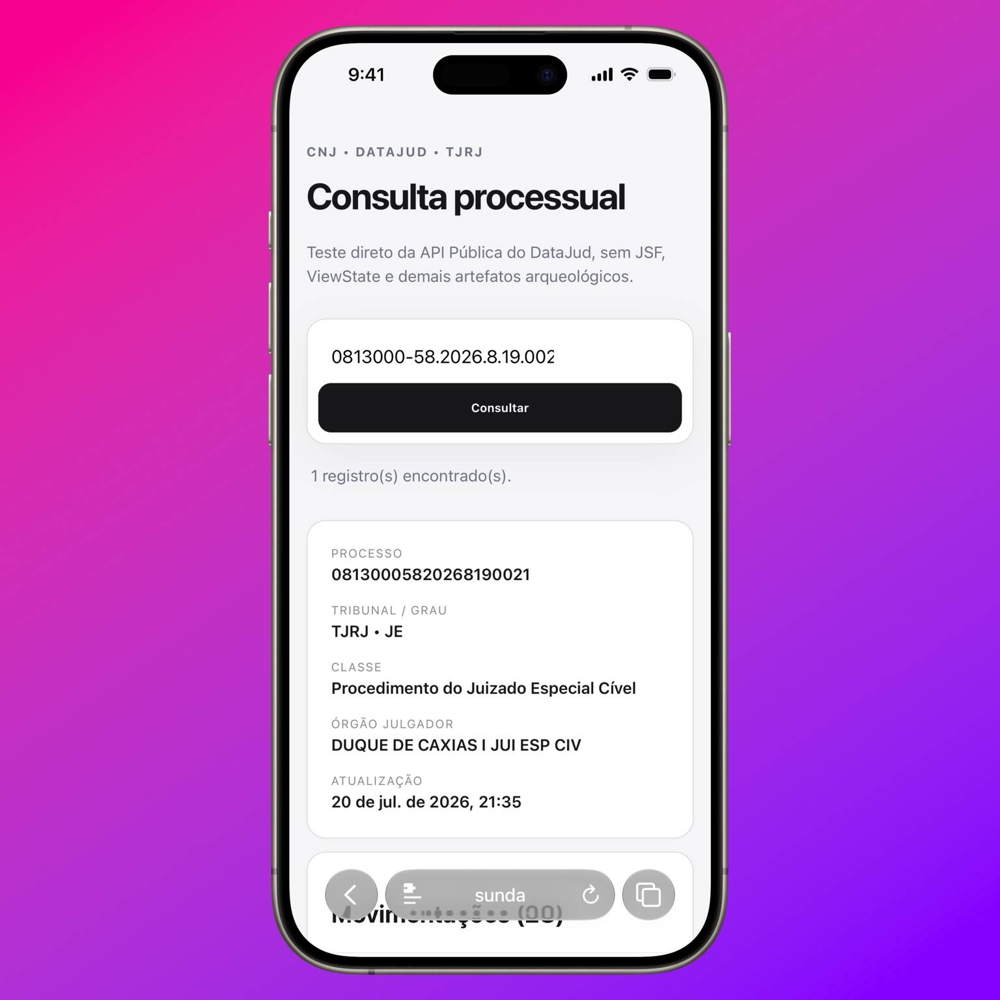

# DataJud Teste

MVP mínimo em Node.js para consultar processos do TJRJ pela API Pública do DataJud/CNJ.



## Requisitos

Node.js 22+.

## Configuração

Configure a API Key pública vigente publicada pelo CNJ no ambiente (por exemplo, em um arquivo `.env` local, que não deve ser commitado):

```dotenv
DATAJUD_API_KEY="sua-chave"
DATAJUD_URL="https://api-publica.datajud.cnj.jus.br/api_publica_tjrj/_search"
PORT=3300
```

Opcionalmente, altere o endpoint com `DATAJUD_URL`.

## Rodar

```bash
npm start
```

Abra `http://localhost:3300`.

O processo de teste já vem preenchido: `0813000-58.2026.8.19.0021`.

Em um deploy na Vercel, as Functions ficam em `api/health.js`, `api/processo.js` e `api/processo/[numero].js`. A rota de consulta é `GET /api/processo/:numero`, por exemplo `GET /api/processo/08130005820268190021`; configure `DATAJUD_API_KEY` e, opcionalmente, `DATAJUD_URL` nas variáveis de ambiente do projeto. A Vercel reconhece o segmento dinâmico pelo nome `[numero]`, sem configuração adicional. A Vercel serve os arquivos estáticos de `public/` automaticamente.

Cada processo também possui um feed RSS em `/api/processo/:numero/feed`, por exemplo:

```text
/api/processo/08130005820268190021/feed
```

O feed consulta o DataJud sob demanda, publica as 50 movimentações mais recentes e usa cache HTTP curto. Números inválidos e processos não encontrados retornam JSON, como nas demais respostas de erro da API.

## Próximos experimentos

1. Comparar movimentos com a Consulta Pública do PJe/TJRJ.
2. Medir a latência entre PJe e DataJud.
3. Persistir snapshots e calcular diffs.
4. Investigar acesso a documentos/PDFs separadamente.
